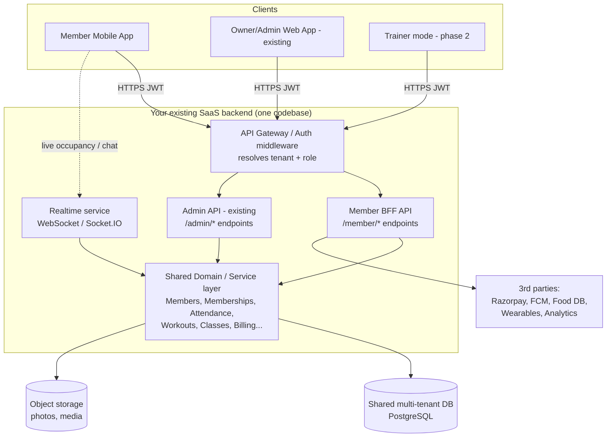
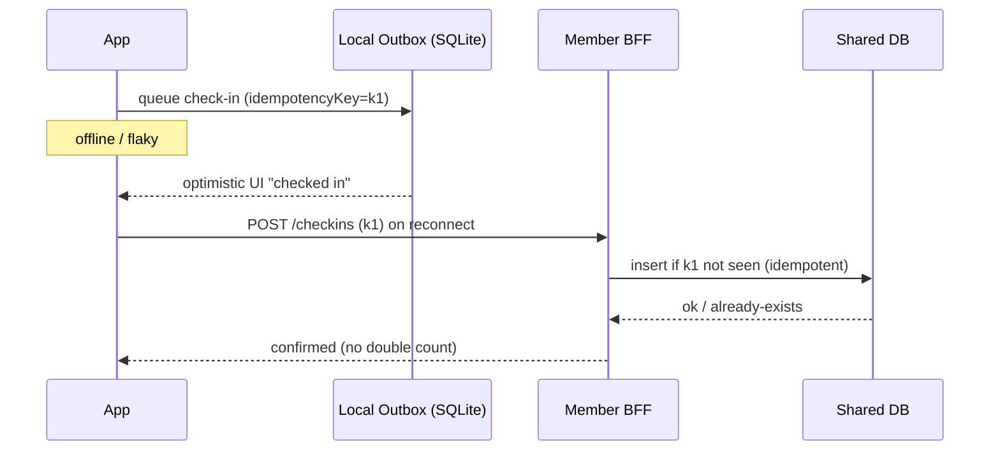

# Technical Requirements Document (TRD)
## Gym Member App — architecture on top of your existing multi-tenant Gym SaaS

| | |
|---|---|
| **Companion doc** | `PRD_Member_App.md` |
| **Core constraint** | Existing **multi-tenant SaaS**, **shared DB**. Member app is a new client that uses the **same data via APIs** — never its own DB, never direct DB access, never admin endpoints. |
| **Status** | Draft v1 — for build |

---

## 1. The central decision: how the member app talks to your SaaS

You asked for *"the best way"* to build this against a shared DB using API calls. Here it is, stated plainly:

> **Do NOT** let the mobile app query the database directly.
> **Do NOT** point the mobile app at your existing admin/owner APIs.
> **DO** add a dedicated **Member API layer (a BFF — Backend For Frontend)** inside your existing backend that reuses your existing domain/service/data layer but exposes **member-shaped, member-scoped** endpoints.

Why a BFF and not "just reuse the admin API":
- **Security:** admin endpoints expose owner-level data and actions. A member must only ever see/do member-level things, scoped to their own gym and their own record. A separate surface makes that boundary explicit and auditable.
- **Shape:** mobile screens need compact, aggregated responses (e.g., one `/home` call returning dashboard data) — not 8 chatty admin calls. The BFF composes them.
- **Versioning:** you can evolve the mobile API without breaking the admin web app, and vice versa.
- **Performance:** BFF can cache, batch, and trim payloads for mobile/low-end-Android reality.

Crucially, the BFF **shares the same database and the same domain/service layer** as your SaaS. You are *not* duplicating data — you're adding a thin, member-safe doorway to the data you already have. That shared DB is exactly why the owner dashboard and the member app stay in perfect sync with zero extra work.



**Golden rule:** the mobile app holds *no* business logic that enforces security and *no* DB credentials. All authorization, tenant scoping, and capacity/limit enforcement happen server-side in the BFF/domain layer. The client is a fast, beautiful renderer of server-authorized data.

---

## 2. Architecture principles

1. **Single source of truth = your SaaS DB.** The app never forks data ownership.
2. **Member BFF is the only door** the app uses. One base URL, e.g. `https://api.yoursaas.com/member/v1/...`.
3. **Tenant is derived server-side**, from the authenticated member's record — never trusted from the client.
4. **Reuse, don't rewrite.** BFF calls the same services your admin API already uses.
5. **Offline-first client, authoritative server.** Client queues writes; server is the referee (it can reject stale/over-capacity actions).
6. **Contract-first APIs** (OpenAPI). The mobile team codes against a typed contract.
7. **Backwards-compatible versioning** so admin and member surfaces evolve independently.

---

## 3. Mobile framework — decision record

Your reference draft assumed **React Native + Expo**. You're an **Angular developer**, so this deserves an honest call rather than a default.

| Option | Pros for you | Cons | Verdict |
|---|---|---|---|
| **React Native + Expo** | TypeScript (you know it), huge ecosystem, mature libs for **HealthKit/Health Connect, BLE, NFC, biometrics, QR**, good 60fps with care, OTA updates via Expo | New paradigm vs Angular (JSX, hooks); some native modules need config | **Recommended** |
| **Flutter** | Best raw performance on low-end Android, gorgeous fitness UI/animation, strong health/BLE packages | Dart is a brand-new language for you; longer ramp | Strong alt if perf is the #1 obsession |
| **Ionic + Angular (Capacitor)** | *Lowest* learning curve — reuses your Angular skills directly | Weakest for heavy native (BLE beacons, deep health sync) and for buttery 60fps on cheap Androids; "premium feel" ceiling is lower | Fastest MVP, but risks the "premium #1" goal |

**Recommendation:** **React Native + Expo.** Reasoning: the app's hardest requirements are *native* (live check-in via QR/NFC/BLE, biometrics, wearable health sync) and *premium 60fps feel on low-end Android* — these are where Ionic struggles and where RN/Flutter shine. Between RN and Flutter, **RN keeps you in TypeScript**, so your Angular/TS muscle memory transfers (types, RxJS-style reactive thinking, async, tooling). You'd learn a new view paradigm, not a new language.

**If you want the fastest path and are willing to accept a slightly lower ceiling for the MVP**, Ionic+Angular is legitimate — but plan to revisit before scaling. *Tell me your choice and I'll tailor the rest of the stack.* The backend/API design below is **framework-agnostic**, so it holds regardless.

---

## 4. API design (the part you asked about most)

### 4.1 Style: REST + a few composite "screen" endpoints
Use **REST** (simpler ops, cacheable, easy to secure) with **composite endpoints** for heavy screens so mobile makes one call, not ten. (GraphQL is optional later if query flexibility becomes a pain; not needed for v1.)

### 4.2 Base & versioning
```
https://api.yoursaas.com/member/v1/...
```
- `/member/` namespace = the BFF surface (separate from `/admin/`).
- `/v1/` = version; never break v1 once the app is in stores.

### 4.3 Representative endpoints (mapped to PRD features → SaaS data)

| Screen / action | Method & path | Reads/Writes (shared DB) |
|---|---|---|
| Login (OTP) | `POST /member/v1/auth/otp/request`, `/verify` | `members`, sessions |
| Home (composite) | `GET /member/v1/home` | attendance, membership, today's plan, next class, occupancy, streak |
| Profile | `GET /member/v1/me` | `members`, `goals` |
| Check-in | `POST /member/v1/checkins` `{method:"qr", token}` | `attendance/check_ins`, `occupancy` |
| Live occupancy | `GET /member/v1/gym/occupancy` (+ realtime channel) | `occupancy` |
| Membership | `GET /member/v1/membership` | `memberships`, `plans`, `invoices` |
| Renew/pay | `POST /member/v1/membership/renew` → Razorpay order | `payments`, `invoices` |
| Today's workout | `GET /member/v1/workouts/today` | `assigned_workouts`, `exercises` |
| Log set/workout | `POST /member/v1/workouts/{id}/logs` | `workout_logs`, `personal_records` |
| Progress | `GET /member/v1/progress` ; `POST /member/v1/progress/metrics` | `body_metrics`, `progress_photos` |
| Classes | `GET /member/v1/classes?date=` | `class_schedule`, `bookings` |
| Book class | `POST /member/v1/classes/{id}/book` | `bookings`, `waitlists` (server enforces capacity) |
| Diet | `GET /member/v1/diet/plan`; `POST /member/v1/diet/logs` | `diet_plans`, `meal_logs` |
| Trainer chat | `GET /member/v1/threads`; realtime channel | `messages`, `trainer_assignments` |

### 4.4 Response shape (consistent envelope)
```jsonc
// GET /member/v1/home  — one call powers the whole dashboard
{
  "data": {
    "greeting": "Good evening, Sneha",
    "membership": { "status": "active", "expiresOn": "2026-06-20", "daysLeft": 19 },
    "streak": { "days": 12 },
    "todayWorkout": { "id": "w_123", "title": "Push Day", "assignedBy": "Kiran", "exercises": 6 },
    "nextClass": { "id": "c_88", "title": "Yoga", "startsAt": "2026-06-01T18:30:00Z", "seatsLeft": 3 },
    "occupancy": { "current": 42, "capacity": 80, "level": "moderate" }
  },
  "meta": { "tenantId": "gym_017", "serverTime": "2026-06-01T12:00:00Z", "cacheTtl": 30 }
}
```
- Always wrap in `data` / `meta` / `error`. Never leak internal IDs/fields the member shouldn't see.
- Use cursor pagination for lists (`?cursor=&limit=`).
- Standard errors: `{ "error": { "code": "MEMBERSHIP_EXPIRED", "message": "...", "retryable": false } }`.

### 4.5 Contract-first
Maintain an **OpenAPI spec** for `/member/v1`. Generate the mobile API client from it (typed). This is what keeps a solo/small team fast and bug-free.

---

## 5. Multi-tenancy & data isolation (your #1 risk)

Every member belongs to exactly one gym (tenant). A leak across tenants is catastrophic. Enforce isolation at **three** layers:

1. **Token:** the member JWT carries `tenantId` (gym) and `memberId`, signed server-side at login. The client cannot change it.
2. **Middleware:** the gateway/BFF reads `tenantId` from the verified token and injects it into a request context. **Client-supplied gym/tenant IDs are ignored.**
3. **Data layer:** every query is automatically filtered by `tenant_id`. Best options on PostgreSQL:
   - **Row-Level Security (RLS)** with a per-request `SET app.tenant_id` — the DB itself refuses cross-tenant rows (strongest), **or**
   - a mandatory repository/ORM scope that injects `WHERE tenant_id = :ctxTenant` on every query (enforced by code review/tests).

> Test this explicitly: write automated tests that authenticate as Gym A's member and assert they get `404/403` for every Gym B resource. Make cross-tenant access a CI failure.

---

## 6. Authentication & authorization

- **Member auth:** phone + OTP (India-first), optional email. On success issue a **short-lived access JWT** (~15 min) + **refresh token** (rotating, revocable). Store tokens in **secure storage** (Keychain/Keystore), never in plain local storage.
- **Biometric unlock** gates app re-entry locally; it does not replace server auth.
- **Claims:** `sub=memberId`, `tenantId`, `role=member`, `scope=[...]`. Admin tokens use a different audience/role; member tokens **cannot** call `/admin/*`.
- **Separation from admin:** member and admin are distinct audiences. Even if someone steals a member token, it authorizes nothing admin-level.
- Reuse your existing SaaS identity store for `members` — don't create a parallel user table.

---

## 7. Real-time architecture

For live occupancy, check-in feedback, class seat counts, and trainer chat:
- **WebSocket (Socket.IO)** alongside the BFF.
- **Tenant rooms:** clients join `gym:{tenantId}` (and `member:{memberId}`, `thread:{id}`) — server validates membership before joining; clients can't subscribe to other gyms.
- Occupancy: server pushes deltas on check-in/out; clients also have a polling fallback (`GET /gym/occupancy`) for flaky networks.
- Keep chat messages persisted via the domain layer (same DB) so history survives reconnects.

---

## 8. Offline-first & sync

Members are mid-workout, in basements, on patchy data. The app must not block.
- **Local store:** SQLite (e.g., WatermelonDB / op-sqlite for RN) or MMKV for light KV. Cache home, today's workout, plans.
- **Outbox pattern:** writes (check-in, set logs, meal logs) are queued locally with a client-generated **idempotency key**, then synced. Server dedups by idempotency key so a retried check-in never double-counts.
- **Conflict policy:** server is authoritative. For logs (append-only) conflicts are rare; for capacity actions (class booking) the server can reject a queued booking if the slot filled — surface a clear "slot filled" message.
- **Background sync** on reconnect / app foreground.



---

## 9. Third-party integrations

| Concern | Recommendation (India-first) | Notes |
|---|---|---|
| Payments | **Razorpay** (UPI, cards, netbanking); webhooks reconcile to SaaS billing | Don't build a parallel billing system; write to existing `payments/invoices` |
| Push | **Firebase Cloud Messaging (FCM)** | Store device tokens per member; segment by tenant |
| Media (photos) | **Object storage** (S3-compatible / Cloudinary) | Store **references** in DB; signed, time-limited URLs |
| Food database | License/integrate an **Indian food DB** (3rd-party) | Don't build from scratch; cache hot items |
| Wearables | **Health Connect (Android)**, **HealthKit (iOS)**; Fitbit/Garmin later | Read on-device; sync **aggregates** with consent |
| Analytics | Product analytics + **crash reporting** | Feed engagement signals back to owner SaaS |
| AI coach (Phase 3) | LLM API with **RAG over the member's own SaaS data** | Guardrails; no medical/diagnostic claims; defer plan changes to trainers |

---

## 10. Security & privacy / compliance

Health/fitness data is **sensitive personal data** under India's **DPDP Act 2023** (and GDPR if you serve EU). Build these in from day one — retrofitting is painful:
- **Consent:** explicit, purpose-specific consent for health/wearable data; easy withdrawal.
- **Rights:** data **export** and **delete (right to erasure)** flows.
- **Encryption:** TLS in transit; encrypt sensitive fields/media at rest; secure token storage on device.
- **Least privilege:** member tokens scoped tightly; progress photos private by default, signed URLs only.
- **Audit:** log access to sensitive records (who/what/when), especially trainer→member data.
- **PII minimization:** the BFF returns only fields the member needs; never dump full SaaS rows.
- **Rate limiting & abuse:** per-member and per-IP limits on auth/OTP and write endpoints.

---

## 11. Performance engineering (to actually hit "premium")

Budget against the PRD targets (<2s cold start, <500ms screens, 60fps):
- **Composite endpoints** (one `/home` call) to cut round-trips.
- **Cache-then-revalidate:** render from local cache instantly, refresh in background.
- **List virtualization**, image lazy-loading + downscaled thumbnails (progress photos, exercise GIFs).
- **Skeleton loaders & optimistic UI** so the app *feels* instant even on 3G.
- **Avoid heavy JS bridges in hot paths** (RN): keep animations on the native/UI thread (Reanimated).
- **Test on low-end Android** in CI/device lab — that's your median Indian user, not an iPhone.
- BFF: response compression, DB indexes on `tenant_id` + hot query columns, connection pooling, short-TTL caching of occupancy.

---

## 12. Observability & ops

- **Logging:** structured logs with `tenantId`/`memberId`/`requestId` (no raw PII in logs).
- **Monitoring/alerting:** latency, error rate, crash-free %, sync failures.
- **Crash + performance reporting** in the app.
- **Analytics events** per PRD §9 funnel.
- **Feature flags** to roll out per-phase and per-tenant (e.g., enable class booking only for gyms that use it).

---

## 13. Environments & delivery

- **Envs:** dev → staging → prod, each with isolated DB/tenants for testing (never test against real gym data).
- **CI/CD:** lint/typecheck/test on PR; build pipelines for app (Android/iOS) and backend; OpenAPI contract checks.
- **OTA updates** (if RN/Expo) for fast JS-only fixes; store releases for native changes.
- **Mobile release hygiene:** staged rollouts, crash-gate before 100%.

---

## 14. Suggested repo structure

If the member app is a sibling to your SaaS (recommended): keep backend changes inside your existing SaaS repo (new `/member` module) and the app in its own repo, sharing types via the OpenAPI-generated client.

```
gym-saas/                      # existing backend (add member module)
  src/
    admin/                     # existing admin API
    member/                    # NEW: member BFF
      routes/                  # auth, home, checkins, workouts, classes...
      controllers/
      validators/
      mappers/                 # SaaS entities -> member-safe DTOs
    domain/                    # SHARED services (reused by admin + member)
    data/                      # repositories (tenant-scoped), migrations
    realtime/                  # socket gateway, tenant rooms
  openapi/member-v1.yaml       # contract (source of truth for the app)

gym-member-app/                # NEW mobile app (RN+Expo recommended)
  src/
    api/                       # generated client from openapi
    features/                  # home, checkin, workout, progress, classes...
    design-system/             # tokens, components (cards, charts, buttons)
    offline/                   # outbox, sqlite, sync
    state/                     # store + cache
    navigation/
```

---

## 15. Upgraded tech stack (vs the draft)

| Layer | Draft | TRD recommendation | Why changed |
|---|---|---|---|
| Mobile | RN + Expo | **RN + Expo** (see §3 decision) — Ionic/Angular only if you accept a lower ceiling | Confirm with your skills/preference |
| UI | NativeWind | NativeWind + a small **custom design system** (tokens) | Premium consistency, per-tenant theming |
| Backend | NestJS | **Reuse your existing SaaS backend**; add a member BFF module | Don't fork; shared DB + shared domain |
| DB | PostgreSQL | **PostgreSQL with RLS** for tenant isolation | Hard isolation guarantee |
| Realtime | Socket.IO | Socket.IO with **tenant rooms** | Prevent cross-tenant subscription |
| Auth | Firebase/Auth0 | **Reuse SaaS identity** + OTP; JWT access/refresh; biometric unlock | Members already exist in your DB |
| Payments | — | **Razorpay** (UPI), webhook reconcile | India-first; the draft omitted payments |
| Media | Cloudinary | Cloudinary / S3, signed URLs, DB references | Privacy for progress photos |
| Push | FCM | FCM | OK |
| Wearables | Health Connect + HealthKit | Same; Fitbit/Garmin later | OK |
| Analytics | Mixpanel | Product analytics + **crash reporting** | Add crash visibility |
| Offline | (implied) | **SQLite + outbox + idempotency** | The draft underspecified this; it's critical |
| Compliance | — | **DPDP Act 2023** alignment | The draft omitted this; health data = sensitive |

---

## 16. Build order (technical, maps to PRD phases)

1. **Phase 0:** member BFF skeleton + auth (OTP/JWT) + tenant middleware + RLS + OpenAPI + app shell + design system + analytics/push wiring.
2. **Phase 1 (core loop):** `/home`, QR check-in (+occupancy), membership read + renew, today's workout + logging, progress (weight + photos). Offline outbox for check-in/logs.
3. **Phase 2:** class booking (capacity-safe), trainer chat (realtime), diet logging, wearable sync, gamification.
4. **Phase 3:** AI coach (RAG over member data), community, store/marketplace, advanced check-in (NFC/BLE/face), Fitbit/Garmin.

Gate each phase on the PRD's activation/retention targets before adding more.

---

## 17. Open technical questions (confirm to finalize)

1. **Backend stack & ORM** of your existing SaaS (so I specify the BFF module precisely and the tenant-scoping mechanism — RLS vs ORM scope).
2. **Mobile framework** — confirm RN+Expo, or tell me you'd rather stay in Angular/Ionic (I'll re-tune §3–§15).
3. **Existing auth** — JWT/sessions today, and do members already have credentials?
4. **Payments** — Razorpay already integrated, or greenfield?
5. **DB engine** — confirmed PostgreSQL? (RLS recommendation assumes Postgres.)

Answer these and I'll turn the BFF endpoints into a concrete OpenAPI spec and a Phase-1 implementation checklist.
