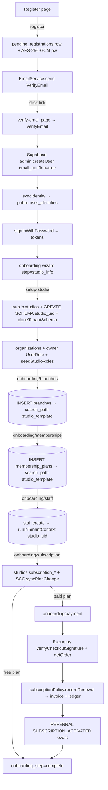

# Module 01 — Auth & Onboarding · Audit Report

**Date:** 2026-06-18
**Branch:** `feat/per-gym-schemas` (active migration — see Risks)
**Auditor:** Claude (Principal-architect audit pass)
**Status:** 🟡 AUDITED — fixes pending owner go-ahead (Auth is a CLAUDE.md hard gate)

> Mode for this module: **audit-first, fix in reviewable slices, pause at every
> hard gate.** Module 1 is *entirely* auth/onboarding, which is an explicit hard
> gate, so **no auth code was changed in this pass.** Findings + proposed slices
> are below; each needs an explicit OK before implementation.

---

## 1. Flow Map

### Entry points
| Surface | Route | Guard |
|---|---|---|
| Web register | `POST /api/v1/auth/register` | public, throttled 5/min |
| Web verify email | `POST /api/v1/auth/verify-email` | public |
| Web resend | `POST /api/v1/auth/resend-verification` | public, throttled 3/min |
| Web login | `POST /api/v1/auth/login` | public, throttled 5/min |
| OAuth (Google/Apple) | `POST /api/v1/auth/oauth/sync` | public, throttled 10/min |
| Onboarding steps 3–8 | `POST /api/v1/auth/{setup-studio,onboarding/branches,onboarding/memberships,onboarding/staff,onboarding/subscription,onboarding/payment,onboarding/skip}` | `JwtAuthGuard` |
| Session/profile | `GET /api/v1/auth/me`, `POST /api/v1/auth/refresh`, `POST /api/v1/auth/logout` | mixed |
| Workspace pick | `POST /api/v1/auth/select-workspace` | `JwtAuthGuard` |
| Password reset | `POST /api/v1/auth/{forgot-password,reset-password}` | public |

### Sequence (register → live gym)

### Tables involved
`public.pending_registrations`, `public.user_identities`, `public.user_roles`,
`public.permissions`, `public.studios`, `public.subscription_plans`,
`public.subscription_events`, `public.invoices`, `public.login_history`,
`public.user_devices`, `public.user_sessions`, `public.referral_*`;
tenant: `organizations`, `branches`, `membership_plans`, `staff` (schema
placement is the #1 finding below).

### RLS / triggers / edge functions / cron
- **RLS:** enabled but **policy-less** on all 39 audited `public.*` tables
  (INFO advisors). Decorative by design — backend connects as a `rolbypassrls`
  superuser. No anon grants detected (Phase 8.1 fix holds). The real keystone
  (non-bypass role) is tracked outside this module.
- **Edge Functions:** none in this flow (auth is all NestJS).
- **Cron:** none directly; `pending_registrations` has a 24h `expires_at` but
  **no reaper** (finding P2-3).
- **Triggers:** none specific to auth tables (app-layer logic only).

---

## 2. Findings

### 🔴 P0 / Critical

**P0-1 — Onboarding splits tenant data across two schemas (data-visibility risk).**
`setupStudio`/`onboarding` create & clone a per-gym schema `studio_{userId}`.
But `onboardingBranches` and `onboardingMemberships` hard-code
`SET LOCAL search_path TO "studio_template", public` — writing into the **shared
template**, while `onboardingStaff` writes into the **per-gym** schema via
`runInTenantContext(schemaName)`. In one onboarding run, branches + plans land in
`studio_template` but staff land in `studio_{userId}`.
Per project memory the live app reads tenant data from `studio_template` by
`gym_id`, and the per-gym `studio_*` schemas are currently empty/stale — which
implies **staff created during onboarding may be written to a schema the rest of
the app never reads.** Suspected real bug; **runtime-unverified** (needs a DB
check of where `StaffService` reads).
→ **HARD GATE + mid-migration.** This is the exact surface of the in-flight
`feat/per-gym-schemas` rebuild. Do **not** patch piecemeal; fold into that
migration's service-rewiring slice. Flagged, not touched.

**P0-2 — Unauthenticated password reset by user-id → account takeover. ✅ FIXED 2026-06-18.**
*Fix:* `reset-password` now posts the Supabase recovery **access_token**; the
backend `getUser()`-verifies it and derives the user id from the verified token
(`ResetPasswordDto.otp` → `access_token`). Frontend reset page stores/sends the
verified token instead of `session.user.id`. Guarded by new safety-net test
`test/safety-net/reset-password.spec.ts` (2 cases). Backend+frontend `tsc`
clean; safety-net suite 5/5 PASS.
Original issue: 
`POST /api/v1/auth/reset-password` is public and does
`admin.updateUserById(dto.otp, { password: dto.new_password })`, where `dto.otp`
is **a user UUID, not a recovery token** (`ResetPasswordDto`: `otp: string`). The
recovery-token exchange happens **client-side** on `/reset-password`
(`supabase.auth.exchangeCodeForSession`) and the page then submits the resolved
`session.user.id`. The backend performs **no verification that the caller holds
the recovery token** — it trusts the supplied UUID. An attacker who learns a
victim's Supabase user-id can POST `{ otp: <victim-uuid>, new_password }` and set
their password, bypassing email entirely.
Exploitability depends on how exposed user UUIDs are (they appear in several
authenticated payloads), but an unauthenticated "set any account's password by
id" endpoint is an auth-bypass regardless. **Fix:** verify the recovery
token/session **server-side** (accept the Supabase access_token from the recovery
exchange and `getUser()` it, or call `verifyOtp`), and derive the user id from
that verified session — never from client-supplied input. *Verified from code
(backend + frontend). HARD GATE (auth) → needs OK.*

### 🟠 P1 / Fix before completion

**P1-1 — `register()` and `verifyEmail()` enumerate all auth users via
`listUsers({ perPage: 1000 })`.** Existing-email detection pages through at most
1000 Supabase users and scans in memory. Past 1000 auth users this both
**mis-detects** (returns nothing for users on page 2+, breaking the
re-registration fast-path and the duplicate guard) and wastes a large API call on
every register/verify. Replace with a direct lookup (Supabase admin
`getUserByEmail` where available, or a `user_identities` email query which is
already indexed). *Verified from code; auth-area → needs OK.*

**P1-2 — Silent verification-email failure.** When `EmailService.send` returns
not-delivered/not-queued, `register` logs an error server-side but still returns
`{ success: true }`; the UI says "check your email" and the user waits forever
with no retry signal. Correct to never leak the link — but the client should get
a soft "we couldn't send right now, tap resend" signal. *UX/reliability.*

### 🟡 P2 / Plan

- **P2-1** `getPlans()` reads via the tenant `prisma` client instead of the
  registry `pub` client (inconsistent with the Phase-7/8 client split).
- **P2-2** `vector` extension installed in `public` schema (advisor WARN) —
  relocate to an `extensions` schema.
- **P2-3** No reaper for expired `pending_registrations` (rows accumulate after
  24h `expires_at`). Add a small cron/cleanup.
- **P2-4** Register form: `phone` is required with no format (E.164) validation
  client- or server-side; password rules are client-only (backend DTO should
  mirror the uppercase/lowercase/number/special rules).

---

## 3. Test results (this pass)
- `backend test/safety-net/login.spec.ts` → **PASS 3/3** (wrong-password, locked
  account, unconfirmed-email branches). Real run, 8.3s.
- DB security advisors pulled live: 39× `rls_enabled_no_policy` (INFO, expected),
  1× `extension_in_public` (WARN, P2-2). No ERROR-level / anon-exposure findings.

## 4. Remaining risks
- P0-1 is entangled with the active `feat/per-gym-schemas` migration — fixing it
  here would collide with that work. Sequence it inside that effort.
- P1-2 (reset) and P0-1 both touch the auth/isolation gate → require explicit OK.
- Frontend onboarding pages (steps 2–9) were not each rendered live; UI audit so
  far covers the register entry point only.

## 5. Completion status
🟡 **AUDIT COMPLETE — IMPLEMENTATION GATED.** Not marked ✅ COMPLETE: P0/P1 fixes
are unimplemented and several sit on the auth/schema hard gate awaiting go-ahead.
