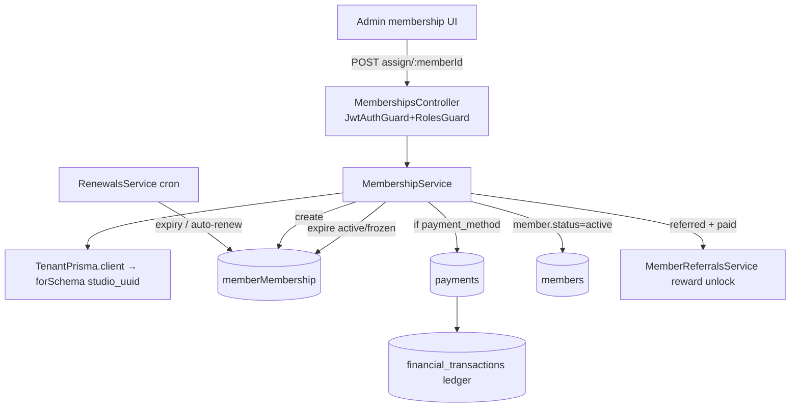

# Module 02 — Memberships · Audit Report

**Date:** 2026-06-18
**Branch:** `feat/per-gym-schemas` (active migration)
**Status:** 🟡 AUDITED — fixes pending OK (tenant-write + billing-adjacent gates)

Scope: member membership lifecycle (assign / renew / freeze / unfreeze / cancel /
track-visit / auto-renew / stats), plans, membership-access, family & corporate.
Time-boxed: lifecycle + isolation + plans audited deeply; `renewals.service` cron
internals and the membership **frontend** are partially covered (noted below).

---

## 1. Flow Map (lifecycle)

### Routes / guards
`/api/v1/memberships` — class-level `JwtAuthGuard + RolesGuard`.
`assign` (owner/branch_manager/front_desk), `freeze`/`unfreeze`/`cancel`
(owner/branch_manager), `renew` (owner/branch_manager/front_desk),
`stats` (owner/branch_manager), `admin/run-*` (owner). **No `@Roles`** on
`findByMember`, `findOne`, `track-visit`, **`auto-renew`** (see P2-M2-3).

### Tables
`member_memberships`, `membership_plans`, `membership_freezes`, `members`,
`payments`, `financial_transactions`, `member_referrals`. All in the per-gym
tenant schema.

---

## 2. Tenant isolation — ✅ STRONG (by construction)

`MembershipService` uses `TenantPrisma.client` → `TenantClientFactory.forSchema()`,
which binds a Prisma client to the gym's **physical schema via the connection
string** and **rejects any name not matching `studio_<uuid>`** (so the shared
`studio_template` cannot be used on this path). Therefore `findUnique({where:{id}})`
reads (`findOne`, `assign`, `freeze`, `renew`…) are isolated **by construction** —
this path is **not** subject to the `findUnique` fails-open / `gym_id`-filter leak
class. Isolation is backed by `scripts/_phase2_isolation_test.js`. *Positive finding.*

---

## 3. Findings

### 🔴 P0 (cross-linked, gated)
**P0-1 (from Module 1) — onboarding/runtime schema split.** Onboarding writes
branches + membership **plans** into `studio_template` (raw `SET search_path`),
but this runtime path reads the per-gym `studio_<uuid>` schema. Plans/branches
created during onboarding are therefore **invisible** to `MembershipService`
(`assign` would reject a valid `plan_id` as "Invalid plan"). Belongs to the
in-flight `feat/per-gym-schemas` rewiring — **do not patch here.**

### 🟠 P1
**P1-M2-1 — 23 unit tests RED from the TenantPrisma rewire.**
`plans.service.spec.ts` + `membership-access.service.spec.ts` fail with
`Cannot read properties of undefined (reading 'membershipPlan'/'member')`: the
services were rewired to `this.tenant.client.*` but the test mocks still inject
the old `prisma` shape. Safety-net is currently non-load-bearing for this module.
Belongs to the migration's test-harness update (don't fix piecemeal mid-migration).
*Verified by running the suites.*

**P1-M2-2 — Money paths are not transactional. ✅ FIXED 2026-06-18 (owner-approved).**
`assign()` and `renew()` now run the full write sequence — expire/mark-old →
create-membership → create-payment → create-ledger → update-member — inside a
single `tenant.client.$transaction(async (tx) => …)`. A mid-sequence failure now
rolls the whole thing back, so there is no "member with no membership" or
"membership with no payment/ledger" partial state. Backend `tsc` clean.
*Original issue:* the sequence was a series of independent awaits with no
transaction boundary.

### 🟡 P2
- **P2-M2-1 — `trackVisit` read-modify-write race. ✅ FIXED 2026-06-18.** Now a
  guarded atomic `updateMany({ where: { remaining_visits: { gt: 0 } }, data: {
  remaining_visits: { decrement: 1 } } })`; `count === 0` → "no remaining visits".
  Concurrent visits can no longer drive the counter below zero. Guarded by
  `test/safety-net/membership-track-visit.spec.ts` (**4/4 PASS**).
- **P2-M2-2 — `renew()` no idempotency / no status guard.** Double-submit →
  double membership + double charge; a cancelled/expired membership can still be
  "renewed" (sets old → `renewed` unconditionally). Add status check + idempotency.
- **P2-M2-3 — Missing role gates.** `auto-renew` toggle (mutating) and the read
  endpoints carry no `@Roles`; any authenticated gym user can flip auto-renew.
- **P2-M2-4 — `assign`/`renew` record `payment.status='paid'` for any method**
  without gateway verification. Fine for cash/admin POS; flag if an online method
  is ever passed here (should verify before marking paid).

---

## 4. Test results (this pass)
- `src/members` suites: **14 pass / 23 fail / 37 total** — all 23 failures are the
  migration-stale-mock issue above (P1-M2-1), not product logic. `plan-pricing.util.spec.ts` PASS.

## 5. Remaining risks / not-yet-covered
- `renewals.service` cron internals (expiry + auto-renew charging) not deep-read —
  auto-renew is the highest-money cron; audit before module sign-off.
- Membership **frontend** (admin UI render/validation/dead-buttons) not yet audited.
- family/corporate membership services skimmed, not deep-audited.

## 6. Completion status
🟡 **AUDIT (partial-depth) — IMPLEMENTATION GATED.** P0-1 & P1-M2-1 belong to the
active migration; P1-M2-2 is billing-gated; P2-M2-1 is a safe fix available on request.
