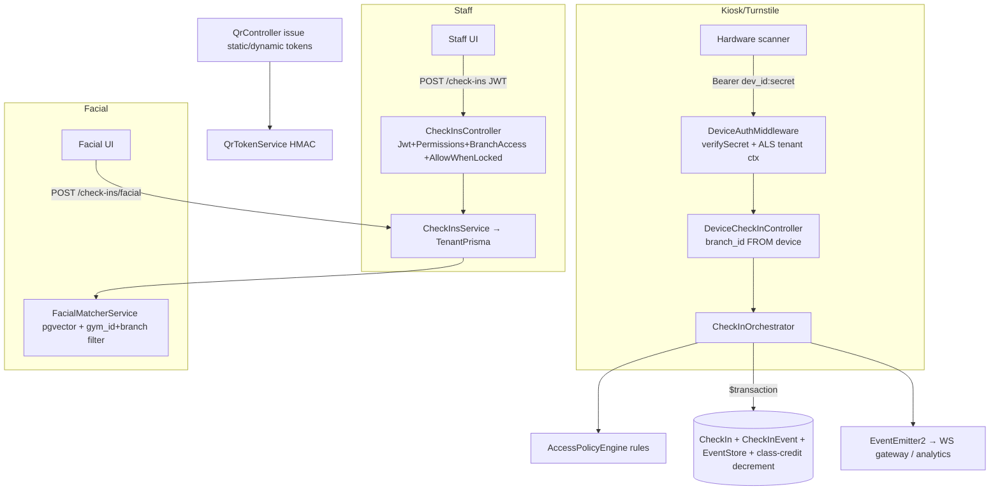

# Module 03 — Check-ins · Audit Report

**Date:** 2026-06-18
**Branch:** `feat/per-gym-schemas` (active migration)
**Status:** 🟡 AUDITED — one verified cross-tenant exposure cluster pending fix (hard gate)

Scope: staff check-in, facial (pgvector) check-in, hardware-device/kiosk scan,
QR token issuance + scan, access-policy engine, offline sync, WS gateway.
Deep-audited: controller guards, facial matcher isolation, device auth, the
check-in **orchestrator**, QR controller. Skimmed: biometric enrollment, WS
gateway internals, individual policy rules (access-scope rule tested separately).

---

## 1. Flow Map

### Guards / auth
- Staff `/check-ins/*`: `JwtAuthGuard + PermissionsGuard + BranchAccessGuard`,
  `@AllowWhenLocked` (entrance must work during a billing lapse — correct),
  override gated by explicit `check_ins.override` permission. **Strong.**
- Device `/check-ins/device/:id/scan`: `DeviceAuthMiddleware` (token verify +
  ALS tenant context); `branch_id` taken **from the device, never the body**.
  Fail-closed, generic 401. **Strong.**

### Tables
`check_ins`, `check_in_events` (append-only), `members`, `member_memberships`,
`branches`, `qr_token_audit`, event-store table, `devices`/device index.

---

## 2. Positives (verified)
- **Facial matcher isolation — strong.** `FacialMatcherService` uses the
  physical-schema `TenantPrisma` client **and** keeps explicit `gym_id` +
  `branch_id` filters; vector literal is sanitized + bound. The prior biometric
  cross-tenant leak is closed and now defense-in-depth.
- **Orchestrator quality — high.** Success path is a single `$transaction`
  (CheckIn + append-only event + last_visit + atomic class-credit decrement +
  event-store), with an in-transaction duplicate re-check and `client_event_id`
  idempotency (P2002 → replay prior event). Signed QR verifies HMAC, enforces
  `sid === gymId`, static `qr_version` match, and dynamic `jti` nonce anti-replay.
- **Access-scope resolver tests: 21/21 PASS** (`fails closed on unknown
  access_type`, sister-branch grants, etc.).

---

## 3. Findings

### 🟠 P1-M3-1 — Cross-tenant member exposure via by-id access on the legacy `prisma` path (R3 class). ✅ FIXED 2026-06-18 (owner-approved).
*Fix:* every by-id member/branch access is now gym-scoped —
`orchestrator` member load → `findFirst({ id, gym_id })`, branch load →
`findFirst({ id, gym_id })`; QR `getStatic`/`getDynamic` → `findFirst({ id,
gym_id: user.studio_id })`; QR `regenerate` now verifies gym ownership via
`findFirst({ id, gym_id })` **before** the `qr_version` write (cross-tenant id →
404, write skipped). Guarded by `test/safety-net/qr-tenant-scope.spec.ts`
(3 cases, incl. "write never happens for a cross-tenant target"). Backend `tsc`
clean; check-ins + QR-scope suites **24/24 PASS**.
*Original issue below.*

The orchestrator and `QrController` still use the legacy `PrismaService`
(`this.prisma`) with **`findUnique`/`update` by `id` and no `gym_id` scope**.
On `findUnique`-by-id the tenant `$use` middleware cannot inject `gym_id`
(fails-open — the documented **R3** risk), and tenant data currently co-resides
in the shared `studio_template`. So a caller authenticated for **gym A**, passing
a **gym B** member UUID, can cross the tenant boundary:

| Location | Op | Impact |
|---|---|---|
| `check-in.orchestrator.ts:114` `member.findUnique({id})` | read | gym B member name/code/membership returned in the check-in **denial payload** (info leak) — reachable from a kiosk passing `member_id` in the body |
| `qr/qr.controller.ts:50` `getStatic` | read + mint | returns any member's `full_name`/`member_code` by UUID and mints a signed QR token |
| `qr/qr.controller.ts:111` `getDynamic` | read + mint | same, dynamic token |
| `qr/qr.controller.ts:77` `regenerate` `member.update({id})` | **write** | bumps **another gym's** member `qr_version`, invalidating that gym's QR cards → cross-tenant tampering / DoS (sharpest edge) |

`PermissionsGuard` confirms the caller holds `members:view/edit` **in their own
gym**, but does not stop them targeting another gym's member id.
Exploitability is bounded (needs a valid gym-A staff JWT or device token **and** a
gym-B member UUID; UUIDs aren't trivially enumerable but do appear in URLs/payloads).
Signed-token paths (orchestrator:333 `stc.mid`, :308 legacy-QR findFirst) are NOT
affected — those ids are HMAC-bound or `gym_id`-scoped.

**Fix (proposed, one slice):** scope every by-id member/branch access by the
authenticated gym — `findUnique({where:{id}})` → `findFirst({where:{id, gym_id}})`
(404 on miss); `update({where:{id}})` → guarded `updateMany({where:{id, gym_id}})`
(or migrate these call sites to `TenantPrisma` like the rest of the module).
**Tenant-isolation hard gate → needs OK before I touch it.**

### 🟡 P2
- **P2-M3-1 — `dayBoundsInTz` (`toLocaleString` round-trip)** is a fragile TZ
  computation for the same-day duplicate window; can be off by a day near
  midnight/DST. Use a proper TZ library or `Intl` parts. Low impact (duplicate
  detection only).
- **P2-M3-2 — Migration debt.** Orchestrator + `QrController` remain on legacy
  `PrismaService` while `CheckInsService`/`FacialMatcher` moved to `TenantPrisma`;
  fold these into the `feat/per-gym-schemas` rewiring (also resolves P1-M3-1
  structurally).

---

## 4. Test results (this pass)
- `src/check-ins` → `access-scope.resolver.spec.ts` **21/21 PASS**. (Other
  orchestrator/biometric paths have no unit suite — gap noted.)

## 5. Remaining risks / not-yet-covered
- WS gateway auth (`check-ins.gateway.ts`) and biometric enrollment not deep-read.
- No unit coverage on the orchestrator's transactional success/denial branches.

## 6. Completion status
🟡 **AUDITED.** P1-M3-1 is a verified cross-tenant exposure (incl. a write/DoS edge)
on the tenant-isolation hard gate — fix proposed, awaiting go-ahead.
