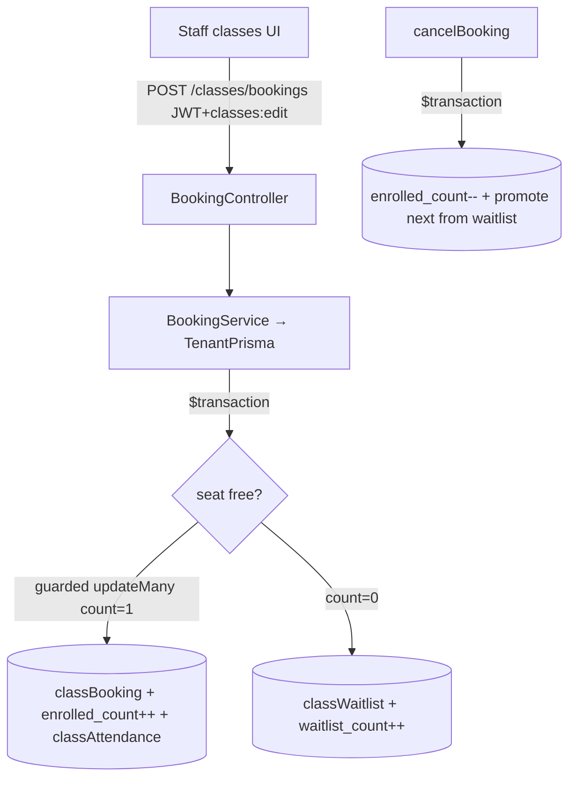

# Module 04 — Classes & Scheduling · Audit Report

**Date:** 2026-06-18
**Branch:** `feat/per-gym-schemas`
**Status:** 🟢 AUDITED — P1-M4-1 (overbooking) fixed; depth gaps noted

Scope: class templates, scheduling (recurring sessions), sessions, **booking +
waitlist**, attendance. Deep-audited: booking/waitlist service + controller.
Skimmed: scheduling, attendance, templates (noted below).

---

## 1. Flow Map (booking)

### Guards
`/classes/bookings/*`: `JwtAuthGuard + PermissionsGuard`, `classes:view|edit`.
`bookClass` reachable only from this **staff** controller — no member-BFF
self-booking path (grep-verified). So booking concurrency = staff-initiated.

### Tables
`class_sessions`, `class_bookings`, `class_waitlist`, `class_attendance`,
`class_templates`, plus trainer/studio relations.

---

## 2. Positives
- **Tenant isolation by construction** — `BookingService` uses `TenantPrisma`
  (physical-schema client); by-id reads are isolated (no R3 here).
- **Booking & cancellation are transactional**, with waitlist auto-promotion +
  position renumber inside the same `$transaction`; duplicate-booking and
  duplicate-waitlist guards via composite unique keys.

---

## 3. Findings

### 🟠 P1-M4-1 — Overbooking race despite the transaction. ✅ FIXED 2026-06-18.
The capacity gate was `if (lockedSession.enrolled_count < capacity)` using a plain
`findUnique` read, then a separate `enrolled_count: { increment: 1 }`. Under
Postgres read-committed isolation (Prisma default), two concurrent bookings at
`capacity-1` both read room and both increment → **capacity exceeded**. The
comment claimed the transaction prevented this; it did not (no row lock /
`FOR UPDATE` / serializable).
*Fix:* claim the seat with a **guarded atomic** `updateMany({ where: { id,
enrolled_count: { lt: capacity } }, data: { enrolled_count: { increment: 1 } } })`;
`count === 1` → book, `count === 0` → waitlist. At most `capacity` claims can ever
succeed. Guarded by `test/safety-net/class-booking-capacity.spec.ts` (2/2 PASS).
Backend `tsc` clean.

### 🟡 P2
- **P2-M4-1 — `cancelBooking` decrements `enrolled_count` without confirming the
  row was actually an enrolled `booked` seat** (only checks `!== 'cancelled'`).
  Cancelling a non-booked/attended row could under-count. Guard on
  `booking_status === 'booked'` before decrementing.
- **P2-M4-2 — No membership-validity check at booking time.** `bookClass` accepts
  any `member_id` and books regardless of active membership / class credits.
  May be intentional (staff override), but worth an explicit policy decision —
  member self-service (if added later) must not bypass entitlement.
- **P2-M4-3 — Waitlist position renumber is O(N) individual `update`s** per
  cancel/remove. Fine for typical class sizes; revisit if large waitlists appear.

---

## 4. Test results
- Classes module had **no tests** before this pass. Added
  `class-booking-capacity.spec.ts` → **2/2 PASS** (`tsc` clean).

## 5. Remaining risks / not-yet-covered
- `scheduling.service` (recurring-session generation: DST, duplicate-slot,
  timezone) not deep-audited — recommended before sign-off.
- `attendance.service` (mark/bulk/complete) and `class-template.service` skimmed.
- Classes **frontend** (schedule grid, booking UI) not audited.

## 6. Completion status
🟢 **AUDITED + 1 FIX.** Booking integrity hardened. Scheduling/attendance/FE depth
deferred (listed) before a full ✅ COMPLETE.
