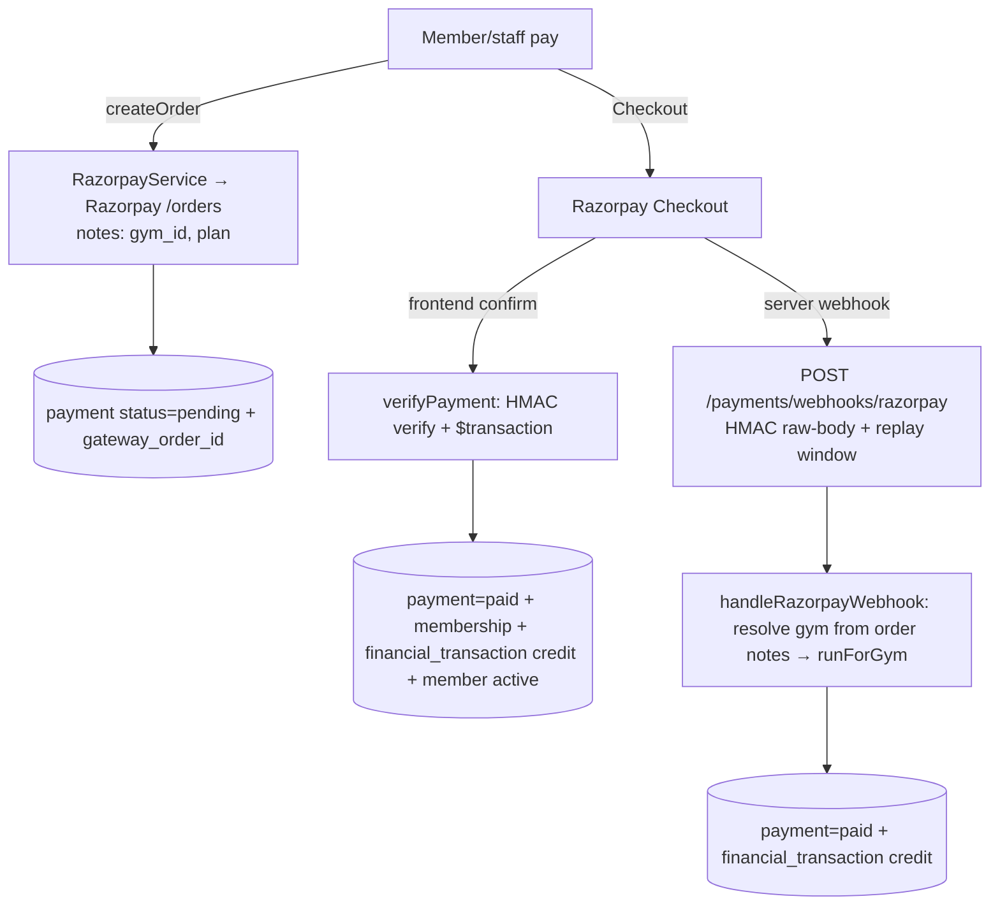

# Module 05 — Payments (Razorpay) · Audit Report

**Date:** 2026-06-18
**Branch:** `feat/per-gym-schemas`
**Status:** 🟡 AUDITED — P1-M5-1 (concurrent double-credit) pending OK (billing hard gate)

Scope: Razorpay order/verify/webhook, member-payment recording, financial ledger,
invoice status, refunds/discounts/expenses (skimmed). Deep-audited: `razorpay.service`,
webhook intake, `payments.service` create/verify/webhook + ledger writes.

---

## 1. Flow Map (member gateway payment)

### Auth / surfaces
- `/payments/webhooks/razorpay`: **no JWT** (Razorpay servers); guarded by
  HMAC-SHA256 raw-body signature + 300s replay window.
- Other `/payments/*`: JWT + permissions (class-level).

### Tables
`payments`, `financial_transactions` (ledger), `member_memberships`, `members`,
`invoices`, `payment_gateway_configs`.

---

## 2. Positives (verified)
- **Signature handling is correct.** Checkout signature = HMAC-SHA256 over
  `order_id|payment_id` with the **key secret**, timing-safe. Webhook = HMAC over
  the **raw body** with the **webhook secret**, timing-safe, with a 300s
  `created_at` replay window. Amounts validated; `createOrder` sets `notes`
  server-side and `getOrder` reads them back **authoritatively** (a client can't
  pay a cheap order then claim an expensive plan).
- **Webhook tenant resolution is safe** — gym derived from the order's server-set
  `notes.gym_id`, then all work runs in that gym's schema (`tasks.runForGym`).
- **Sequential idempotency** — both webhook + verify select the payment by
  `status='pending'`; once `paid`, a retry no-ops.

---

## 3. Findings

### 🟠 P1-M5-1 — Concurrent confirmation double-credits the ledger (and double-creates membership). ✅ FIXED 2026-06-18 (owner-approved).
*Fix:* both `verifyPayment` and `handleRazorpayWebhook` now CLAIM the
`pending→paid` transition with a guarded `tx.payment.updateMany({ where: { id,
status: 'pending' }, … })` and run the membership/ledger side effects only when
`claim.count === 1`. The `UPDATE` row-lock serializes concurrent writers; the
loser matches 0 rows (`verify` throws "already processed", `webhook` returns) — no
duplicate membership or double credit. Guarded by
`test/safety-net/payment-atomic-claim.spec.ts` (4/4 PASS: lost-race + won-race for
both paths). Backend `tsc` clean.
*Original issue below.*

Both confirmation paths use **check-then-act** on `status='pending'` with a
non-locking `findFirst`, then perform side effects unconditionally:
- `handleRazorpayWebhook` (payments.service.ts:388–418): `findFirst pending` →
  `update paid` + **`financialTransaction.create` (credit)**.
- `verifyPayment` (payments.service.ts:204–254): inner `findFirst pending` →
  create **membership** + `update paid` + **credit** + activate member.

Under Postgres read-committed (Prisma default), two overlapping confirmations for
the same order — webhook×webhook (Razorpay at-least-once), verify×verify
(double-click/retry), or **verify×webhook** — both observe `pending` (neither has
committed) and both run the side effects → **duplicate credit ledger rows** for
one payment (over-stated revenue) and, on `verifyPayment`, a **duplicate
membership**. The inner `findFirst` does not serialize concurrent transactions
(no row lock / `FOR UPDATE` / serializable).

**Fix (proposed):** atomically CLAIM the transition before side effects —
`const claim = await tx.payment.updateMany({ where: { id, status: 'pending' },
data: { status: 'paid', paid_at, gateway_payment_id, gateway_order_id } });
if (claim.count !== 1) { /* already processed → no-op / throw */ }` — then create
membership/ledger only when `count === 1`. The `UPDATE` row-lock serializes
writers; the loser sees `count 0`. Same atomic-claim pattern already applied in
Modules 2–4. **Billing hard gate → needs OK before I touch it.**

### 🟡 P2
- **P2-M5-1 — `x-razorpay-event-id` is read but unused.** Status-gate covers
  duplicate deliveries today; an explicit `processed_webhook_events(event_id)`
  unique table would harden against the P1-M5-1 race independently of DB isolation.
- **P2-M5-2 — Raw-body fallback** `rawBody ? … : JSON.stringify(req.body)` fails
  **closed** (re-serialized body won't match the signature) — acceptable, but
  worth asserting `rawBody` presence explicitly so a misconfig is loud, not a
  silent 403 for every webhook.

---

## 4. Test results
- No payment-confirmation concurrency tests exist. `expenses/__tests__` present
  (not run this pass). Recommend a safety-net test for the atomic claim once fixed.

## 5. Remaining risks / not-yet-covered
- Refunds (`refunds.service`), discounts, expenses, financial-reports skimmed.
- Per-gym `payment_gateway_configs` override path (vs env keys) not deep-audited.
- SaaS-subscription payment path (onboarding/subscription) audited in Module 1;
  it uses `recordRenewal` (separate, ledgered) — cross-check in Module 9.

## 6. Completion status
🟡 **AUDITED.** Signature/tenant handling strong. P1-M5-1 is a verified money-integrity
race on the billing hard gate — fix proposed, awaiting go-ahead.
