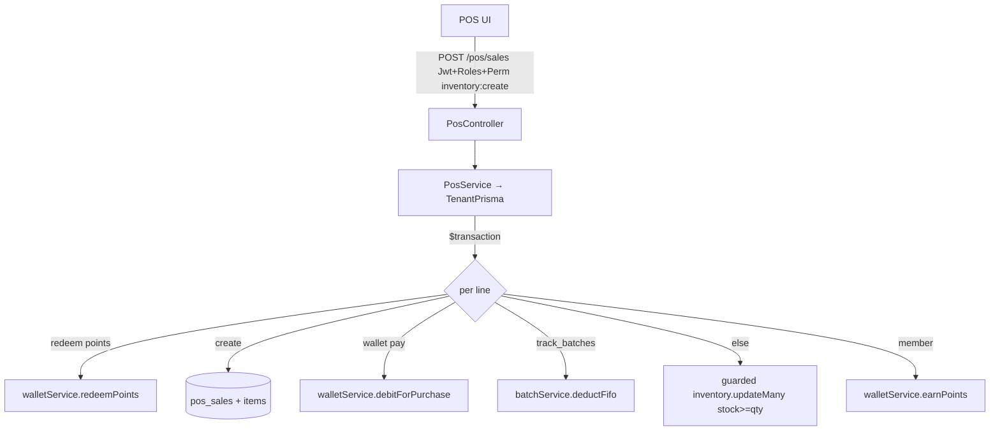

# Module 06 — Inventory / POS · Audit Report

**Date:** 2026-06-18 · **Branch:** `feat/per-gym-schemas`
**Status:** 🟢 AUDITED — healthy; one P2 (return race) documented, no P0/P1

Scope: POS sale, returns, stock deduction (aggregate + FIFO batches), bundles,
wallet/points, daily reports. Deep-audited: `pos.service` + `pos.controller`.
Skimmed: batch/bundle/transfer/purchase-order services.

## 1. Flow (POS sale)

## 2. Positives (verified)
- **Oversell prevented correctly.** Non-batch deduction is a guarded atomic
  `inventory.updateMany({ where: { …, stock_quantity: { gte: qty } }, data: {
  decrement } })` with `count !== 1` → "insufficient stock". Two concurrent sales
  of the last unit can't both win. (Confirms the phase-1 fix in project memory.)
- **Whole sale is transactional** — points redeem + sale + items + wallet debit +
  stock deduction + points earn all in one `$transaction`; insufficient stock
  rolls the entire sale back.
- **Isolation by construction** (`TenantPrisma`); GST CGST/SGST/IGST split by
  place-of-supply vs seller state; per-branch price overrides honored.
- **Controller guards present** — `JwtAuthGuard + RolesGuard + PermissionsGuard`,
  `inventory:create/view`; daily report further role-gated.

## 3. Findings

### 🟡 P2-M6-1 — Return over-refund race.
`processReturn` checks `dto.quantity > saleItem.quantity - alreadyReturned`
**outside** the transaction (lines 444–453), then creates the return + restores
stock inside the tx. Two concurrent returns for the same sale line both read the
same `alreadyReturned` and both pass → over-refund + over-restore stock. Lower
frequency than sales (returns are manual), but a money-integrity edge.
*Fix options:* move the eligibility check inside the tx with a guarded/locked
read (e.g. a conditional insert, or `SELECT … FOR UPDATE` on the sale line / a
unique partial constraint on returned totals). Billing-adjacent → would need OK.

### 🟡 P2-M6-2 — Per-line GST rounding drift.
`cgst = sgst = tax_amount / 2` rounded per line; summed line roundings can drift a
paisa from the invoice `tax_amount`. Cosmetic/accounting; consider largest-remainder
allocation if invoices must foot exactly.

## 4. Tests
- No POS unit tests found. Oversell + return-race are the high-value targets if a
  safety-net suite is added.

## 5. Not-yet-covered
- `batch.service.deductFifo` internals (assumed guarded — not line-read),
  `bundle.service`, `transfer.service`, `purchase-orders.service`, inventory FE.

## 6. Completion status
🟢 **AUDITED — healthy.** No P0/P1. P2-M6-1 (return race) + P2-M6-2 (rounding)
documented for a follow-up slice.
