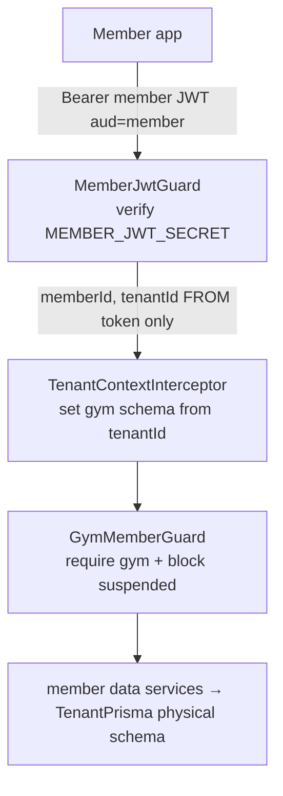

# Module 08 — Member BFF (mobile) · Audit Report

**Date:** 2026-06-18 · **Branch:** `feat/per-gym-schemas`
**Status:** 🟢 AUDITED — code healthy/isolation strong; ⚠️ tests red from migration

Scope: member auth (member-audience JWT), tenant-context wiring, gym-member gating,
member billing/renewal, and the member data services (class/checkin/health/chat/
community/nutrition/exercise). Deep-audited: auth guard, tenant interceptor,
GymMemberGuard, MemberBillingService. Representative; not every data service line-read.

## 1. Auth / isolation model

## 2. Positives (verified — this is a strong module)
- **Audience isolation.** `MemberJwtGuard` verifies a member-audience token with a
  **separate secret**; admin/Supabase tokens fail. `{ memberId, tenantId }` come
  **only from the verified token**, never the client. Public/lead users get
  `memberId=''` so a gym-less token can't be mistaken for a gym scope.
- **Tenant schema from the JWT.** `TenantContextInterceptor` routes the tenant
  client to the gym's physical schema resolved from the verified `tenantId`
  (cached). Member reads are physically isolated.
- **Gym gating + operator suspension.** `GymMemberGuard` 403s non-gym users and
  blocks gym features when `studios.suspended_at` is set — via the member's **own**
  tenant PK (no cross-gym read), while leaving personal health data available.
- **Explicit R3 defense.** `MemberBillingService.renew` re-validates `planId`
  against `member.tenantId` with an explicit `gym_id` filter **before** delegating
  to `PaymentsService` (which resolves the plan via `findUnique` — the fails-open
  class). Identity (`memberId`) is taken only from the verified token. This is
  exactly the right mitigation and shows the team designs against the known leak.

## 3. Findings

### 🟠 P1-M8-1 (cross-cutting) — Member BFF unit tests broadly RED from the TenantPrisma migration.
`npx jest src/member` → **55 pass / 60 fail / 115**. The dominant failure is
`Cannot read properties of undefined (reading 'member'/'membershipPlan')` —
services were rewired to `this.tenant.client.*` but the test mocks still inject the
old `prisma` shape (same root cause as **P1-M2-1**). Notable: this masks real
regressions — the safety net is down for the member surface during the migration.
**Owned by the `feat/per-gym-schemas` test-harness update**; not fixed piecemeal.
*Verified not a regression from this audit's Module-4 booking change* — the
member-class booking test fails at `tenant.client.member` (before any booking
logic), and `member-auth`/`member-data`/`personalization` suites **pass**.

### 🟡 P2-M8-1 — Triage two non-mock failures.
`member-health.service.spec` (`VALIDATION_FAILED` expectation mismatch) and
`idempotency.service.spec` may be behavior-level rather than the mock issue —
triage these individually rather than assuming they're migration noise.

### 🟡 P2-M8-2 — Recommend an own-data sweep of chat/community.
Identity is correctly token-sourced in the services read; recommend a focused
pass over `member-chat.service` (thread access) and `member-community.service`
(leaderboard exposes other members by design) to confirm no endpoint accepts a
client-supplied other-member id for private data.

## 4. Test results
- `src/member`: 55 pass / 60 fail (≈ all the P1-M8-1 mock issue). Passing suites
  include `member-auth`, `member-data`, `personalization`.

## 5. Completion status
🟢 **AUDITED — code healthy, isolation strong.** No code P0/P1. The headline risk is
**test-suite health** (P1-M8-1), owned by the active migration.
