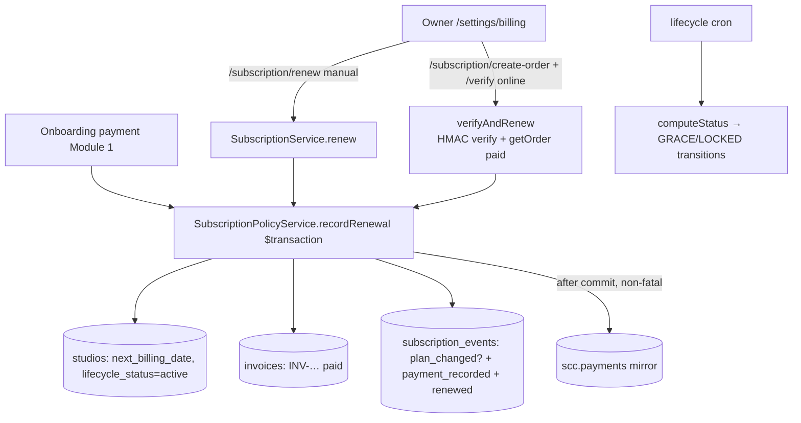

# Module 09 — Billing & Subscription (SaaS: gym → MuscleX) · Audit Report

**Date:** 2026-06-18 · **Branch:** `feat/per-gym-schemas`
**Status:** 🟡 AUDITED — P1-M9-1 (renewal idempotency) pending decision (billing hard gate)

Scope: subscription lifecycle state machine (`SubscriptionPolicyService`), renewal
(`recordRenewal` + `subscription.service` manual `renew` / online `verifyAndRenew`),
invoices, SCC mirror. Onboarding-payment caller covered in Module 1.

## 1. Flow

## 2. Positives (verified)
- **`recordRenewal` is a clean single `$transaction`** — studio row + invoice + 3
  ledger events move together; SCC mirror runs **after commit** (non-fatal) so a
  rolled-back renewal never leaks a phantom payment.
- **Strict continuity** — `period_start = prior next_billing_date`, so a customer
  never gets free days by renewing early or switching plans.
- **Lifecycle state machine** — `computeStatus` precedence SUSPENDED > LOCKED >
  GRACE > ACTIVE; check-ins are `@AllowWhenLocked` (entrance survives a billing lapse).
- **Online path is gateway-verified** — `verifyAndRenew` checks the checkout HMAC
  **and** re-reads the order (`status=paid`, amount/ownership) before crediting.
  Amounts resolved server-side (client amount never trusted). Owner/brand_owner gated.

## 3. Findings

### 🟠 P1-M9-1 — Renewal is not idempotent → replayed payment double-bills. ✅ MITIGATED 2026-06-18 (app-level; schema follow-up open).
*Fix shipped:* `recordRenewal` now takes a `payment_reference` and, inside the
transaction, short-circuits if a prior `payment_recorded` event already carries
that reference for the studio — returning the prior renewal (no new period, no
duplicate invoice, no duplicate SCC mirror). Threaded through all three callers
(`verifyAndRenew` → `renew`, manual `renew`, onboarding). Guarded by
`test/safety-net/renewal-idempotency.spec.ts` (2/2 PASS); backend `tsc` clean.
*Still open (gated):* this is app-level dedup — fully race-proof concurrent-replay
handling needs a **DB unique constraint** on the payment reference (Prisma
migration = hard stop). Recommended as the robust follow-up; deferred for explicit
schema approval.
*Original issue below.*

`recordRenewal` has **no idempotency key**, and neither caller dedups the payment
reference:
- `verifyAndRenew` (online): `verifyCheckoutSignature` + `getOrder` are **stateless**
  — re-posting the same `gateway_payment_id` passes both checks again → a second
  `recordRenewal` → **another full billing period + a duplicate paid invoice**.
- `renew` (manual): re-submitting the same UTR/`payment_reference` likewise renews
  twice (owner double-click).
The verification blocks *fake* payments but not *replayed real* ones. Result:
inflated `next_billing_date` (customer over-credited) + duplicate invoice + duplicate
`payment_recorded` ledger event + duplicate `scc.payments` mirror.

**Fix options (needs your call — billing + possibly schema gate):**
1. **App-level dedup (no schema):** before `recordRenewal`, look up an existing
   `subscription_event`/`invoice` carrying the same `payment_reference` and
   short-circuit (return prior result). Handles the common double-click/retry;
   not fully race-proof without a constraint.
2. **Schema-backed (robust, hard gate):** add a unique index on the payment
   reference (e.g. `invoices.payment_reference` or a dedicated
   `subscription_payments` row) so concurrent replays collide at the DB. Requires
   a migration → explicit confirmation.

### 🟡 P2-M9-1 — `invoice_number` generation is `count + probe`, not a sequence.
`generateInvoiceNumber` counts today's invoices then probes for a free suffix
inside the tx. Under concurrent renewals this can retry; the unique constraint
saves correctness but it's not a true gapless sequence. Acceptable; revisit if
invoice numbering must be strictly gapless/auditable.

## 4. Tests
- No direct `recordRenewal` idempotency/continuity test found (computeStreakDays-style
  pure tests exist elsewhere). High-value safety-net target once P1-M9-1 is fixed.

## 5. Not-yet-covered
- Lifecycle cron (grace→lock→suspend transitions) internals; dunning emails;
  cancel/refund subscription path.

## 6. Completion status
🟡 **AUDITED.** Lifecycle + online verification strong. P1-M9-1 (renewal idempotency)
is a verified billing-integrity gap — fix approach pending your decision.
