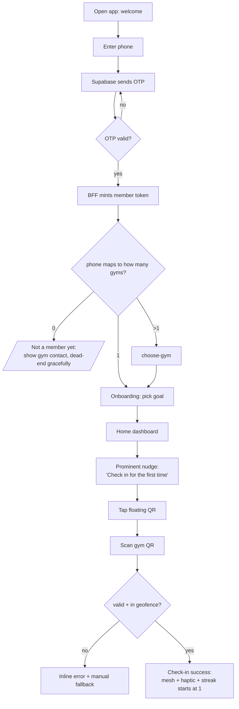
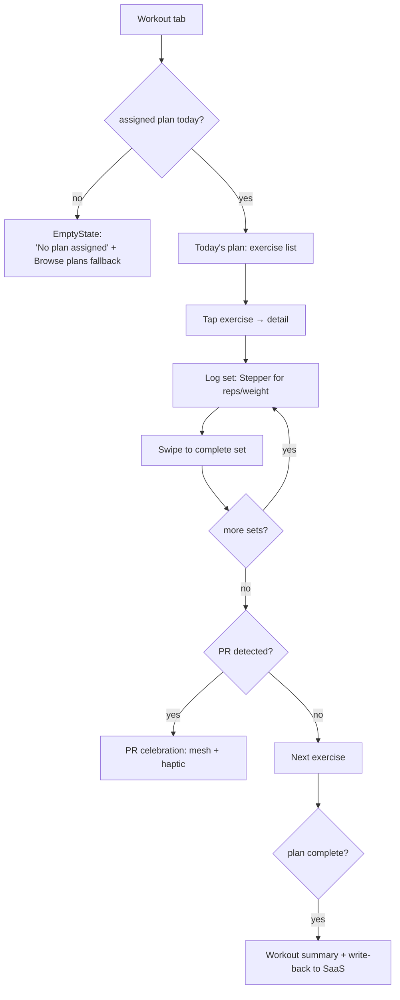
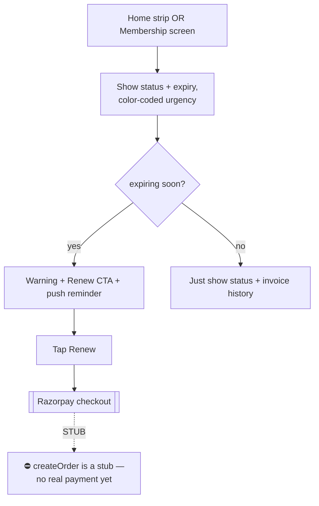

# User Flows — Member App

> The critical journeys, step by step, with decision points and failure paths. Personas from
> `PRD_Member_App.md §3`. Flows marked with the build status of their backing endpoints.

Legend: ✅ backed & built · 🟡 partial/empty data · 🔴 not built · ⛔ blocked

---

## Flow 1 — First-time onboarding & first check-in  ✅ (auth) 🟡 (home)
**Persona:** Ravi (beginner) — highest churn risk. This flow's success ≈ activation metric.


**Design intent:** get a beginner from install → first check-in in < 3 min, unaided (research gate).
**Failure design:** the "0 gyms" branch must not feel like an error — it's a not-yet-a-member, handled with warmth.

---

## Flow 2 — Daily check-in (the habit core)  ✅
**Persona:** Sneha (regular) — does this 4×/week. Must be the fastest path in the app.

```
Home (app already open OR opened from notification)
   → tap floating QR (1 tap)
   → scan (auto-focuses camera)
   → success animation + streak increment + haptic
   → auto-return to Home showing updated streak
```
- **Target: ≤ 2 taps, ≤ 5 seconds.** No confirmation dialog — check-in is instant and logged.
- Edge: already checked in today → success screen shows "Already in — since 6:42 AM," not an error.
- Edge: camera/permission denied → manual code entry fallback.

---

## Flow 3 — Today's workout & set logging  🟡 (empty until admin authoring exists)
**Persona:** Arjun (lifter) — hates friction/typing.


- **One-thumb law:** Stepper + swipe, keyboard never required for normal logging.
- **Reality flag:** plans come from trainers via the SaaS admin. *No admin authoring UI exists yet* → this flow shows EmptyState for every member until that's built. **This is the #1 thing blocking Workout from feeling real.**
- Writes use the offline outbox; sets logged offline sync later.

---

## Flow 4 — Logging & seeing progress  🟡 (metrics ✅, photos ⛔)
**Persona:** all — strongest retention lever (PRD §6.5).

```
Progress tab
   → log weight (Stepper / quick input)
   → chart updates immediately (optimistic)
   → [photos] capture/upload transformation photo   ⛔ blocked: no storage signing
   → before/after slider
   → weekly report card (trend, streak, PRs this week)
```
- Show progress **even on day 1** (e.g., "1 check-in this week", "streak: 1") — never an empty motivational screen.
- **Reality flag:** photo upload is blocked until object-storage signed URLs exist (TRD). Design the flow now; gate the build.

---

## Flow 5 — Membership awareness & renewal  🟡 (view) ⛔ (pay)
**Persona:** all; owner cares most (renewals = revenue).


- **Phase 1 = read-only** (status, expiry, invoices). Renewal transactions are **Phase 2 and blocked** until Razorpay `createOrder` is real. Design the renewal flow; do **not** wire fake payments.
- Expiry urgency: >14d neutral · ≤14d `warning` · expired `error` — color **+ text + icon** (a11y).

---

## Flow 6 — Class booking (Phase 2)  🔴
**Persona:** Divya (women members) — privacy/safety matter.

```
Classes tab → browse schedule → class detail (trainer, seats, time)
   → {seats available?}
        yes → one-tap book → confirmation + calendar add + reminder
        no  → join waitlist → notify if seat opens
   → My bookings → cancel (within policy) → seat releases to waitlist
```
- Research Q6 gates design: women-only slots, control over who sees attendance.
- No backing models yet — design now, build in Phase 2.

---

## Flow 7 — Re-engagement (notification → return)  🟡
The loop that fights churn (Ravi/lapsed users).

```
Trigger (habit gap / class soon / streak risk)
   → push notification (respecting frequency cap)
   → deep-link straight to the relevant screen (not a cold Home)
   → one clear action waiting there
```
- Each notification deep-links to the action, never dumps the user on a generic Home.
- Frequency cap from IA §5 prevents the #1 uninstall trigger (spam).

---

## Cross-cutting failure & edge rules

| Situation | Behavior |
|---|---|
| Network offline | Cached reads + queued writes (outbox); subtle offline marker |
| Token expired | Silent refresh; only bounce to login if refresh fails |
| Wrong/stale data | Pull-to-refresh; never show another member's data (tenant + member scoping enforced server-side) |
| Permission denied (camera/notifications) | Graceful fallback + a settings deep-link, never a dead end |
| Empty domain (no plan, no classes) | Designed EmptyState with a fallback action |
